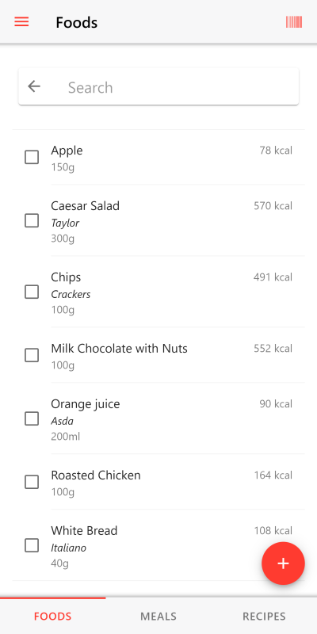
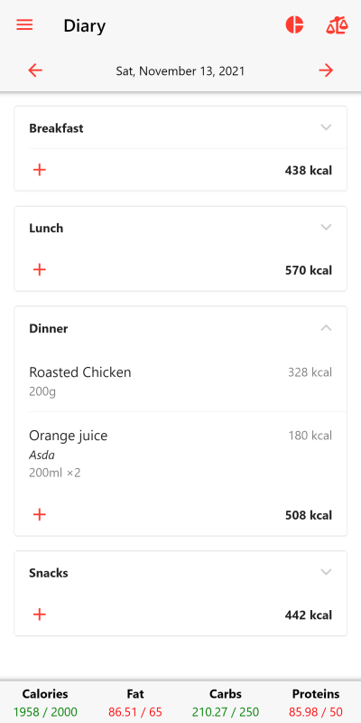
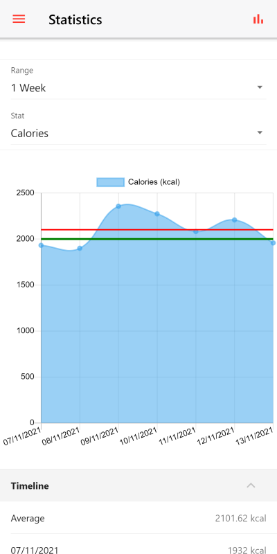
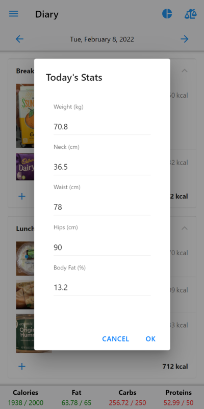

# Waistline

Waistline is a libre calorie counter and weight tracker app for Android. It's built with Cordova, Framework7, and a few other free libraries.

### App Features

Check out the [user guide](FAQ.md) for a detailed explanation of the features and for frequently asked questions. Features of Waistline include:

- Diary: This is where users can keep a day-by-day account of the food they eat at different times.
- Food List: This is where users can create a local database of foods. This can be done either by inputting the food details manually, by scanning the barcode of a product, or by searching for the product online. Waistline can connect to Open Food Facts and the USDA food database to find information about products.
- Import and export functionality to backup and restore app data.
- Waistline is free and open source software.
- Waistline doesn't contain any ads or in-app purchases.
- Waistline works on Android devices 5.0+ (and might work on older devices).

## License

Waistline is licensed under the [GNU GPLv3](https://www.gnu.org/licenses/gpl-3.0.en.html). The full license file is in the www sub-folder and the license notice is placed at the top of every source file. The folders outside of the www directory are generated by the Cordova framework and contain their own (GPL compatible) license files.

## Privacy Policy

This Privacy Policy explains and gives information regarding the collection, use, and disclosure of personal data when you utilize Waistline and the choices you have associated with that data. By utilizing the software, you accept the terms and conditions of this Policy. This Policy applies to this software and the developer is not responsible for the content or privacy practices on any third-party app not operated by the developer to which this software links or that links to this software.

### Information Collection and Use

Waistline only requires the availability of an internet connection when the barcode of a product is scanned, when searching for a product online, or when uploading a product to the Open Food Facts database. During a scan or a search, the only information sent to Open Food Facts or the USDA is the product barcode or the search terms entered.

For the software to function efficiently camera and storage permissions are required. These are needed to be able to scan barcodes, upload product images, and to import and export data.

### Types of Data Collected

#### Personal Data
No personal data is collected while utilizing the software.

#### Usage Data
Usage data is collected only when interacting with the Open Food Facts or USDA databases.

### Security of Data

The security of your data is important but no method of transmission over the internet or electronic storage is 100% secure, therefore the developer doesn't guarantee its absolute security.

### Service Providers

Waistline requires third-party databases (Open Food Facts and USDA) to facilitate some of its functionality.

### Changes to this Privacy Policy

This privacy policy may be updated from time to time as the functionalities of the software are further developed and improved and may contain disparities that will nullify this current policy.

## Disclaimer

Waistline is developed in good faith and for general use. The developer will not be held accountable for how you decide to use this software and will not be liable for any losses and/or damages in connection with the use of the software.

## Developer

Waistline was created by me, David Healey, and is developed with suggestions and contributions from users. Waistline is freely available from the links at the bottom of this page.

If you enjoy using Waistline, consider donating to [Open Food Facts](https://world.openfoodfacts.org/contribute). They freely provide and maintain the online database that Waistline uses.

Please spread the word and share this app with anyone you think could benefit from it. Also, let me know if you find any bugs and I'll try to squish them.

### GitHub

This project is currently hosted on GitHub. This is not ideal; GitHub is a
proprietary, trade-secret system that is not Free and Open Souce Software
(FOSS). I am deeply concerned about using a proprietary system like GitHub
to develop FOSS projects.

Any use of this project's code by GitHub Copilot, past or present, is done
without my permission. I do not consent to GitHub's use of this project's
code in Copilot.

## Localization

This project is localized using Crowdin: 

## Contributing

Check out the [contributor's guide](CONTRIBUTING.md)

## Contact

The best method to contact me about this app is by opening an issue on [GitHub](https://github.com/davidhealey/waistline). Contributions, suggestions, and bug reports are welcome.

Waistline can be downloaded from

